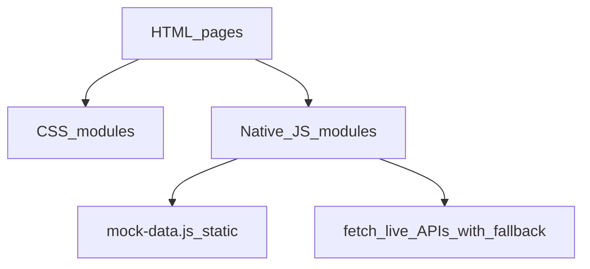

# 澜存 · LANCUN

Web 编程期末大作业 — 海洋保护展示与互动网站

| 项 | 内容 |
|----|------|
| 学号 | 10255501409 |
| 姓名 | 廖俊杰 |
| 在线演示 | [https://lancun-wtqm.vercel.app/](https://lancun-wtqm.vercel.app/) |
| 技术栈 | 原生 HTML5 · CSS3 · JavaScript ES6+ |

---

## 快速开始

### 在线访问（推荐）

直接打开 [https://lancun-wtqm.vercel.app/](https://lancun-wtqm.vercel.app/) 即可浏览全站。部署为**纯静态站点**，不依赖 Node 服务器；账户、打卡、档案等个人数据通过浏览器 `localStorage` 保存在本机（详见 [§6 本地伪后端与浏览器数据持久化](#6-本地伪后端与浏览器数据持久化独立章节)）。

### 本地运行

```bash
# 在项目根目录
npm run serve          # 静态站，默认 http://localhost:5500
```

可选（本地开发增强，非答辩必需）：

```bash
npm run dev:apis       # 海洋页 / 呼救页 live 数据代理（:8788）
npm run api            # 物种 AI 识图代理（ECNU 多模态）
```

- Live API 或 AI 代理未启动时，相关模块会自动 **mock 降级**，页面仍可正常浏览。
- AI 识图架构说明见 [`docs/SPECIES_AI_LOCAL.md`](docs/SPECIES_AI_LOCAL.md)。

---

## 评分标准对照说明

本文档结构对齐课程评分表：**基准要求（80%）** 与 **加分项（20%）**。其中涉及「数据库 / 后端」的内容不在 §3 展开，统一放在 **§6 独立章节**。

---

## 1. 主题及原创（基准）

### 选题与叙事

- **主题**：海洋保护 — 以海洋生命的美丽、活力与深邃感吸引用户，再引导理解污染现状与公众可参与的保护行动。
- **名称**：**澜存（LANCUN）** — 留住浪潮与深海，寓意守护海洋生机。
- **叙事路径**：欣赏海洋之美 → 产生好奇 → 理解现状（[`pages/rescue.html`](pages/rescue.html)）→ 认识物种（[`pages/species.html`](pages/species.html)）→ 参与行动（[`pages/action.html`](pages/action.html)）→ 沉淀个人守护档案（[`pages/profile.html`](pages/profile.html)）。
- **表达原则**：不以堆叠污染灾难或恐吓式视觉推动主题；数据与科普并重。

### 原创与合规

- 网站结构、视觉系统、交互与脚本为**个人独立完成**；未使用 React / Vue 等前端框架掩盖基础技术。
- 数据、图片、参考代码均记录出处，见 [`docs/DATA_SOURCES.md`](docs/DATA_SOURCES.md)。
- 志愿报名、公益支持、账户密码等均为**课程演示**，无真实支付、无真实商业后台。

---

## 2. 功能效果（基准）

### 站点页面

| 页面 | 路径 | 核心功能 |
|------|------|----------|
| 首页 | [`index.html`](index.html) | 全屏 Hero 背景视频、WebGL 地球探索、五大洋标记与 modal |
| 我们的海洋 | [`pages/ocean.html`](pages/ocean.html) | 6 张数据看板（Coral Watch + NOAA）、海的作用 4 卡 + CO₂ 折线、五大洋 Tab 探索 |
| 海在呼救 | [`pages/rescue.html`](pages/rescue.html) | 污染压力数据、四路实时监测（可降级）、污染源科普与行动 CTA |
| 海洋生物档案 | [`pages/species.html`](pages/species.html) | 100 条物种库、多维检索、详情抽屉、AI 识图、用户新增档案 |
| 保护行动中心 | [`pages/action.html`](pages/action.html) | 每日环保打卡、徽章证书、志愿任务板、模拟公益支持 |
| 我的界面 | [`pages/profile.html`](pages/profile.html) | 守护档案仪表盘、个人资料、显示偏好、本地数据导入/导出 |

### 作业硬性要素对照

| 要求 | 实现位置 | 说明 |
|------|----------|------|
| ≥ 3 个页面 | 上述 6 页 | 五页内容 + 首页 |
| 图片 | 全站 Hero / 物种卡 / 行动封面等 | 来源见 `DATA_SOURCES.md` |
| 表格 | 呼救污染源表、profile 行动记录、物种数据条等 | 原生 `<table>` 或语义化列表 |
| 文字与链接 | 全站导航、Footer、页内深链 | 节间叙事完整 |
| 表单 | 登录/注册、打卡、志愿、捐款、物种新增、profile 资料 | 含标签、校验、错误与成功反馈 |
| 数据显示 | 海洋/呼救看板、图表、profile 统计 | 静态 mock + 可选 live fetch |

### 海洋守护者账户（简要）

- 右上角头像 → **先打开账户菜单**（非直接弹登录框）→ 菜单内登录 / 注册。
- 已登录菜单 7 项：个人信息、环保打卡、荣誉证书、志愿报名、公益支持、新增物种档案、退出登录。
- 设置类功能（个人资料、显示与播放、登录与安全）在 **我的界面** 侧栏完成，菜单内不再重复「账户设置」入口。

---

## 3. 技术实现（基准）

> 本节仅描述**前端技术路线**。浏览器 `localStorage` 模拟持久化见 [§6](#6-本地伪后端与浏览器数据持久化独立章节)。

### 技术选型

| 层级 | 说明 |
|------|------|
| HTML5 | 语义化结构；`<video>` 背景；`<dialog>` 记录详情；表单 `required` / `type` / `autocomplete` |
| CSS3 | 响应式布局；玻璃拟态与海水蓝设计 token（[`DESIGN.md`](DESIGN.md)、[`assets/css/base.css`](assets/css/base.css)）；`prefers-reduced-motion` 降级 |
| JavaScript ES6+ | 原生模块化 IIFE；事件驱动；无 SPA 框架 |

### 前端架构概览



### 主要脚本目录

| 路径 | 职责 |
|------|------|
| [`assets/js/app.js`](assets/js/app.js) | 全站导航、账户菜单、登录注册、profile 仪表盘联动 |
| [`assets/js/utils/authStorage.js`](assets/js/utils/authStorage.js) | 账户读写（接口层，存储细节见 §6） |
| [`assets/js/globe/`](assets/js/globe/) | 首页 WebGL 地球、气泡、五大洋标记（Three.js vendor） |
| [`assets/js/ocean-dashboard.js`](assets/js/ocean-dashboard.js) | 海洋页看板与五大洋 |
| [`assets/js/rescue-dashboard.js`](assets/js/rescue-dashboard.js) | 呼救页数据与监测 |
| [`assets/js/species/`](assets/js/species/) | 物种库、检索、抽屉、AI Lab |
| [`assets/js/action/`](assets/js/action/) | 打卡、志愿、捐款、成果轮播 |
| [`assets/js/mock-data.js`](assets/js/mock-data.js) | 静态数据与 API 失败降级 |

### 可选本地代理（非站点主体）

为规避浏览器 CORS 与 API Key 泄露，本地开发可选用 Node 脚本转发外部 API（**Vercel 部署不运行**）：

- [`server/dev-apis.mjs`](server/dev-apis.mjs) — Coral Watch / NOAA / OpenAQ 等
- [`server/ecnu-proxy.mjs`](server/ecnu-proxy.mjs) — 物种 AI 识图

---

## 4. 作品呈现（基准）

### 视觉与体验

- **气质**：通透海水蓝、纪录片式叙事、克制玻璃 UI（参见 [`docs/ACCOUNT_SYSTEM_RULES.md`](docs/ACCOUNT_SYSTEM_RULES.md)）。
- **响应式**：桌面 / 平板 / 375px 宽度下布局可用，避免横向溢出与遮挡。
- **无障碍**：键盘焦点、ARIA 标签、Esc 关闭弹层；减少动态效果偏好下关闭背景视频与 heavy 动画。
- **稳定性**：外部接口失败时使用 mock 数据；控制台无阻塞性 JS 错误。

### 项目文档

- 需求与范围：[`docs/PROJECT_BRIEF.md`](docs/PROJECT_BRIEF.md)
- 验收自检：[`docs/ACCEPTANCE.md`](docs/ACCEPTANCE.md)
- 数据来源：[`docs/DATA_SOURCES.md`](docs/DATA_SOURCES.md)
- 各页「宪法」：`docs/OCEAN_PAGE.md`、`RESCUE_PAGE.md`、`SPECIES_PAGE.md`、`ACTION_PAGE.md` 等

---

## 5. 加分项

| 加分项 | 本项目实现 |
|--------|------------|
| **数据显示** | 海洋 6 看板、呼救污染指数与图表、profile 行动统计与热力图；静态 JSON + 可选 live API |
| **界面美观、主题独特** | 全站背景视频、大疆风海水蓝 glass、物种/行动/profile 专项样式表 |
| **JavaScript 特效** | WebGL 地球与折射气泡、GSAP 滚动、打卡 7 日条、成果轮播、账户菜单霜化动画 |
| **其他技术** | HTML5 音视频；Canvas 识图压缩；IntersectionObserver 控制 rAF；键盘/ARIA；性能上 DPR cap 与移动端实例降级；可选 Node 代理（见 §3，属辅助加分） |

---

## 6. 本地伪后端与浏览器数据持久化（独立章节）

> **重要说明**：本项目**没有真实服务器数据库**。  
> 部署到 Vercel（[https://lancun-wtqm.vercel.app/](https://lancun-wtqm.vercel.app/)）后，交付物为**纯静态 HTML/CSS/JS 与媒体资源**。  
> 所有「账户注册登录 / 打卡 / 志愿 / 捐款 / 物种新增 / 个人档案」均通过浏览器 **`localStorage` 在本机模拟持久化** — 数据不会上传云端，换浏览器或清除站点数据后会丢失。

本节专门说明这类「伪后端 / 本地数据库」操作，与 §3 前端实现分离，便于评阅与答辩说明。

### 6.1 账户与会话

实现：[`assets/js/utils/authStorage.js`](assets/js/utils/authStorage.js)

| localStorage Key | 内容 |
|------------------|------|
| `ocean-auth-users` | 已注册用户列表（**演示用明文 password**，切勿用于真实场景） |
| `ocean-auth-current-user` | 当前登录用户快照（不含 password） |
| `lancun.account` | 与行动中心兼容的旧版账户桥接 |
| `lancun.session` | 登录会话 `{ username, loggedIn }` 桥接 |

### 6.2 保护行动中心

实现：[`assets/js/action/`](assets/js/action/) 下各 `*Storage.js`

| localStorage Key | 内容 |
|------------------|------|
| `ocean-action-checkins.{username}` | 每日打卡记录（ISO 日期） |
| `ocean-action-badges.{username}` | 已解锁徽章 ID 列表 |
| `ocean-action-volunteer-registrations` | 志愿报名记录（按 username 过滤） |
| `ocean-action-donations` | 模拟公益支持记录 |
| `lancun.actions` | 行动记录摘要（legacy） |
| `lancun.points` | 积分（legacy） |
| `lancun.checked-days` | 旧版打卡日（可迁移至新 key） |

### 6.3 个人档案与物种

| localStorage Key | 内容 | 实现 |
|------------------|------|------|
| `ocean-user-profile` | 昵称、宣言、邮箱等扩展资料 | [`assets/js/app.js`](assets/js/app.js) profile 模块 |
| `ocean-user-preferences` | 视频背景、减少动效等偏好 | 同上 |
| `ocean-life-user-species` | 用户新增的物种档案条目 | [`assets/js/species/utils/localSpeciesStorage.js`](assets/js/species/utils/localSpeciesStorage.js) |

### 6.4 部署环境 vs 本地开发

| 环境 | 静态页面 | §6 localStorage | Live 外部 API | AI 识图 |
|------|----------|---------------|---------------|---------|
| **Vercel 线上** | 是 | 是（仅用户浏览器） | 经 Vercel Serverless / 环境变量或 mock 降级 | mock 或配置的 API |
| **本地 `npm run serve`** | 是 | 是 | 需 `npm run dev:apis` 才有完整 live | 需 `npm run api` + Key |
| **直接双击 HTML** | 部分功能路径受限 | 是 | 多为 mock | mock |

### 6.5 用户如何管理本地数据

在 [`pages/profile.html`](pages/profile.html)：

- **导入 / 导出 JSON**：打包六类档案数据，便于备份或换机迁移（仍仅限本机文件）。
- **分类型清空**：打卡、报名、捐款、全部档案等（需二次确认）。
- **退出登录**：清除当前会话，不删除历史档案（除非主动清空）。
- **登录与安全**：说明本地模拟性质；可清空身份资料。

### 6.6 安全与伦理声明

- 密码以明文存入 `localStorage` **仅为 Web 编程课程前端演示**。
- 志愿报名、公益支持**不产生真实效力**，无真实支付通道。
- 正式产品应使用服务端哈希、HTTPS 会话与合规数据库；本作品**刻意不实现**真实后端。

---

## 附录 A · 目录结构

```text
web hw/
├── index.html                 # 首页
├── pages/
│   ├── ocean.html             # 我们的海洋
│   ├── rescue.html            # 海在呼救
│   ├── species.html           # 海洋生物档案
│   ├── action.html            # 保护行动中心
│   └── profile.html           # 我的界面
├── assets/
│   ├── css/                   # base + 各页专项样式
│   ├── js/                    # 交互脚本（globe / species / action / app…）
│   └── media/                 # 图片、视频（部分大文件可能本地保留）
├── data/                      # 物种库、志愿/捐款静态数据
├── docs/                      # 项目文档与数据来源
├── scripts/                   # 验收与数据校验脚本（开发用）
├── server/                    # 可选 Node 代理（非 Vercel 静态包必需）
├── DESIGN.md                  # 全站视觉基准
├── README.md                  # 本文件
└── package.json               # npm scripts
```

---

## 附录 B · 相关文档索引

| 文档 | 用途 |
|------|------|
| [`docs/PROJECT_BRIEF.md`](docs/PROJECT_BRIEF.md) | 项目需求与范围 |
| [`docs/PAGE_STRUCTURE.md`](docs/PAGE_STRUCTURE.md) | 信息架构 |
| [`docs/ACCEPTANCE.md`](docs/ACCEPTANCE.md) | 最终验收清单 |
| [`docs/DATA_SOURCES.md`](docs/DATA_SOURCES.md) | 数据与素材出处 |
| [`docs/SPECIES_AI_LOCAL.md`](docs/SPECIES_AI_LOCAL.md) | AI 识图与本地代理 |
| [`docs/ACCOUNT_SYSTEM_RULES.md`](docs/ACCOUNT_SYSTEM_RULES.md) | 账户系统协作规则 |
| [`AGENTS.md`](AGENTS.md) | 仓库协作约定 |

---

## 附录 C · 引用与许可

- 正式数据与图片引用以 [`docs/DATA_SOURCES.md`](docs/DATA_SOURCES.md) 为准。
- 第三方库：Three.js、GSAP 等见 [`assets/js/vendor/README.md`](assets/js/vendor/README.md)。
- 本仓库代码为课程个人作业；外部素材遵循各来源授权要求，商用前须另行核实。

---

*最后更新：2026-07-23*
