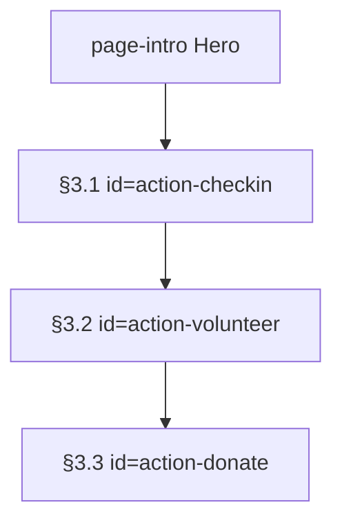

# 「保护行动中心」页面宪法

## 文档状态

- 版本：1.0
- 状态：讨论中（三节架构、mock 数据 schema、localStorage 契约与 Phase 0–4 已写入；实现轮视觉待用户确认）
- 最近更新：2026-07-18
- 适用范围：[`pages/action.html`](../pages/action.html) 及其脚本、样式、本页数据源
- 冲突优先级：用户当前对话明确要求 → `AGENTS.md` → **本文档** → `PAGE_STRUCTURE.md` → 根目录 `DESIGN.md`

本文档是「保护行动中心」板块的**唯一权威**计划兼实现宪法。未写入本文或仍标「待确认」的内容，不得当作最终决定去实现。

---

## 0. 用户需求摘要

以下为你在全局架构与行动中心细化讨论中已确认的要求；细则见 §2–§8 与附录 A–F。

| 需求 | 你的决定 |
|------|----------|
| 改版优先级 | 除**首页**与**「我的」**外，各板块需大改；行动中心在 ocean / rescue / species 宪法就绪后推进 |
| 页面定位 | **用户参与感**为核心：日常打卡、志愿报名、模拟捐款三类路径；全部为**前端模拟 + localStorage** |
| 页面结构 | 单页纵向 **三节**：① 每日打卡 ② 志愿者报名 ③ 公益捐款 + 往期成果 |
| 数据策略 | 全部来自 [`assets/js/mock-data.js`](../assets/js/mock-data.js) 轻量表格/数组；**禁止**后端、禁止伪造「实时 API」 |
| 登录 | 打卡/报名/捐款记录与登录 `username` 绑定；未登录打卡须提示「请先登录后打卡」 |
| 视觉 | 深海玻璃拟态 + 大疆通透蓝调；用户方案中 1280px / 12px / 90px 映射到 `DESIGN.md` token，**禁止**自创未定义样式 |
| 模拟声明 | 志愿与捐款须页内可见 disclaimer：课程作业模拟，无真实效力/支付 |
| 仍待你确认 | 项目封面图最终素材；志愿/成果卡片实景图（实现轮可先用渐变占位） |

---

## 1. 页面定位

- 主题线：把「理解海洋保护」转化为**可完成的个人行动**（打卡积分、志愿意向、支持意向），服务叙事「理解现状 → 参与行动」。
- **禁止**在本页出现：污染监测 dashboard、实时水质 API、恐吓式堆叠文案（归 [`docs/RESCUE_PAGE.md`](RESCUE_PAGE.md)）。
- **禁止**伪造真实支付或真实报名接口；所有提交均为本地演示。
- 与 [`docs/RESCUE_PAGE.md`](RESCUE_PAGE.md) 边界：rescue 第三节 CTA「前往保护行动」链至本页；本页**不**重复污染科普。
- 与 [`pages/profile.html`](../pages/profile.html) 边界：积分、行动记录、打卡日历、报名/捐赠明细的**汇总仪表盘**在「我的」；本页可展示当前用户积分摘要（打卡区左栏），但不替代 profile 侧栏视图。
- 技术：原生 HTML5 / CSS3 / JavaScript ES6+；登录 gating 复用 [`assets/js/app.js`](../assets/js/app.js) 的 `isLoggedIn()` / `getAccount()`。
- 视觉：版心、玻璃、圆角、阴影、动效一律使用 `DESIGN.md` 已定义 token；先出结构框架稿，**未经用户确认不做最终美化**。
- **不改**：首页整体与「我的」界面（本宪法范围外）。复用全站顶栏与用户菜单组件。

---

## 2. 已锁定产品决定

| 项 | 决定 |
|----|------|
| 路由 | 单页 `pages/action.html`，不拆子路由 |
| 布局 | 主内容区 **纵向三节**（顺序固定，见 §3）+ 现有 `page-intro` Hero |
| 删除项 | 现有 `checkin-layout` + 行动类型 `<select>` + 右侧积分 `profile-summary` 侧栏布局 |
| 删除项 | 现有 `data-volunteer-form` 单表单（姓名/联系方式/兴趣下拉） |
| 删除项 | 现有 `data-donation-open` 占位按钮 + `data-project-list` 两卡列表 |
| 删除项 | 现有 `mock-data.js` → `projects[]` 两卡（由附录 B/C 数据集替代） |
| 删除项 | 现有 `app.js` → `setupActions()` 内联逻辑（迁至附录 F 模块） |
| 新增 | `assets/js/action-page.js` + `assets/css/action-page.css` |
| 数据 | 方案 A（锁定）：mock 表格 + localStorage；见 §4 |

---

## 3. 三节信息架构（固定顺序）

整体：全站顶栏 → `page-intro` → `page-island` 内三节，区块纵向间距 **90px**（`margin-block: 5.625rem` 或等价 section token）。



### 3.1 第一节 — 每日打卡行动中心

- DOM 锚点（实现时必须提供）：`id="action-checkin"`。
- 目的：积分体系 + 月度日历，强化日常参与感。

**布局**（桌面 ≥1200px）：

- 左右分栏 **35% / 65%**，间距 **24px**（`var(--space-3)`），同高对齐。
- 左：`[data-action-checkin-summary]`
- 右：`[data-action-checkin-calendar]`

**左侧 — 积分与打卡状态**（自上而下）：

1. 区块标题：「每日环保打卡」+ 副标题「累计打卡，守护蔚蓝」
2. **3 张**竖向 metric 小卡：
   - 总积分：`[data-action-points-total]` + 说明「累计获得环保积分」
   - 连续打卡天数：`[data-action-streak]` + 说明「连续打卡天数」
   - 今日状态：`[data-action-today-status]`（「今日未打卡 / 已打卡」+ 状态图标）
3. 打卡主按钮 `[data-action-checkin-btn]`：
   - 未打卡且已登录：主色填充「立即打卡」
   - 已打卡：灰色 disabled「今日已完成」
   - 未登录：disabled + `[data-action-checkin-hint]`「请先登录后打卡」
4. 积分规则说明（小字列表，附录 A）

**右侧 — 月度打卡日历**：

- 头部：当前年月 `[data-action-cal-month]`；左右箭头 `[data-action-cal-prev]` / `[data-action-cal-next]` 切换月份
- 7 列网格（周一至周日）`[data-action-cal-grid]`
- 已打卡：主色填充 + 白色日期 + 对勾（`.is-checked`）
- 今日：白色描边圈（`.is-today`）
- 未来日期：浅灰、不可点击（`.is-future`）
- 周末：文字色轻微区分（`.is-weekend`）
- 底部统计条：本月累计打卡天数 `[data-action-cal-month-days]`、本月获得积分 `[data-action-cal-month-points]`

**核心逻辑**（附录 A）：

- 打卡成功：写入 ISO 日期、更新积分、更新连续天数、标记日历、追加 `lancun.actions[]`
- 连续 7 天额外 +30、连续 30 天额外 +150（达成日一次性发放）
- 所有读写与登录 `username` 绑定（附录 D）

### 3.2 第二节 — 志愿者报名模拟系统

- DOM 锚点：`id="action-volunteer"`。
- 目的：项目列表 + 报名表单 + 本地记录；满足课程「表单 + 表格模拟数据」要求。

**布局**：

- 顶栏 Tab（`role="tablist"`）：
  - `data-action-volunteer-tab="browse"` — 可报名项目（默认）
  - `data-action-volunteer-tab="records"` — 我的报名记录
- 内容区 `[data-action-volunteer-panel]` 随 Tab 切换

**Tab1 — 可报名项目**：

- 竖向 **3–4** 张项目卡 `[data-action-volunteer-list]`
- 单卡横向：左封面 `[data-volunteer-cover]`，右信息与按钮
- 字段：项目名称、时间、地点、招募人数、剩余名额进度条、简介 1–2 句、「立即报名」
- 进度条 `<30%` 剩余时变 `var(--warning)`（附录 E）
- 满员（`remainingSlots === 0`）：按钮 disabled「名额已满」
- 页顶或区块内 disclaimer：「本页面为课程作业模拟，不产生真实报名效力」

**报名弹窗** `[dialog data-action-volunteer-dialog]`：

- 字段：姓名（必填）、联系电话（必填，格式校验）、身份证号（可选）、参与场次、备注
- 提交：模拟 **1s** loading（`aria-busy`）→ 成功 Toast/文案 → `remainingSlots--` → 写入 `lancun.action.volunteer.{username}`
- 取消 / 遮罩关闭；焦点 trap；`Escape` 关闭

**Tab2 — 我的报名记录** `[data-action-volunteer-records]`：

- 列表：项目名称、报名时间、活动状态（未开始 / 进行中 / 已结束）
- 「取消报名」：名额退回、删除本地记录
- 空状态：「还没有报名记录」

**预设 mock 数据**：附录 B。

### 3.3 第三节 — 公益捐款入口 + 往期项目成果

- DOM 锚点：`id="action-donate"`。
- 目的：模拟捐款档位 + 资金说明 + 往期成果展示（表格/卡片数据来自 mock）。

**上半 — 捐款交互区**（桌面左右分栏）：

- 左 `[data-action-donate-form]`：
  - 标题「支持海洋保护」+ 说明
  - 档位 **2×2** 网格：`[data-donation-tier]` — 10 / 30 / 100 / 自定义（附录 C.1）
  - 选中态：主色填充；未选中：玻璃描边
  - 自定义金额输入 `[data-donation-custom]`（仅数字，选择自定义时显示）
  - 「匿名捐赠」checkbox
  - 「确认支持」主按钮
  - 小字：「本页面为课程作业模拟演示，不产生任何真实支付」
- 右 `[data-action-fund-uses]`：标题「您的支持将用于」+ **4** 条分项（图标 + 说明，附录 C.2）

**模拟支付流程** `[dialog data-action-donate-dialog]`：

1. 点击确认 → 弹窗显示金额与用途摘要
2. 「确认支付」→ 1s loading
3. 感谢弹窗 → 写入 `lancun.action.donations.{username}`
4. 全程标注模拟属性

**下半 — 往期保护项目成果** `[data-action-past-projects]`：

- 4 列网格（平板 2 列、移动 1 列）
- 单卡：封面图、项目名称、执行时间、核心成果数字（高亮）、简短说明
- 数据：附录 C.3

---

## 4. 数据源策略（强制）

### 4.1 Mock 数据（`mock-data.js`）

| 键名 | 用途 | 附录 |
|------|------|------|
| `actionVolunteerProjects[]` | 可报名志愿项目（含名额） | B |
| `actionPastProjects[]` | 往期成果展示 | C.3 |
| `actionDonationTiers[]` | 捐款档位文案 | C.1 |
| `actionFundUses[]` | 资金去向说明 | C.2 |

- 名额 `remainingSlots` 初始值来自 mock；用户报名后**同时**更新 localStorage 中的项目快照或全局名额表（实现轮二选一，须在 `action-page.js` 顶部注释说明；**推荐** per-user 记录 + 读取 mock 初始值减去本机已报总数，避免多账号污染——课程演示以单账号为主，可简化为全局 `lancun.action.volunteer.slots` 对象）。

### 4.2 localStorage（按用户 + 全局）

| Key | 内容 | 与 profile 关系 |
|-----|------|-----------------|
| `lancun.points` | 总积分（全局，现有） | profile 概览 |
| `lancun.actions` | 行动记录数组（现有，扩展 `type`/`date`/`points`） | profile 行动表 |
| `lancun.action.checkins.{username}` | 打卡 ISO 日期列表 + streak 元数据 | profile 打卡视图 |
| `lancun.action.volunteer.{username}` | 报名记录数组 | 可选后续在 profile 展示 |
| `lancun.action.donations.{username}` | 捐赠记录数组 | 可选后续在 profile 展示 |

**废弃**：`lancun.checked-days`（仅存 1–31 的旧设计）→ 迁移见附录 D。

### 4.3 禁止项

- 后端 API、支付 SDK、短信验证码、真实身份证联网校验
- 伪造「已对接某某公益组织」文案（除非 source-note 标明演示）

---

## 5. 视觉与动效

- 玻璃容器：`backdrop-filter: blur(20px) saturate(130%)`；背景 `rgba(59, 130, 246, 0.10–0.15)`；边框 1px `rgba(255,255,255,0.25)`；圆角 `var(--radius)` **12px**
- 版心：`var(--page-width)`（75rem / 1200px）；用户方案 1280px **不另设**，服从 DESIGN
- 区块间距：**90px**（`5.625rem`）
- 区块内边距：**24px**（`var(--space-3)`）
- 过渡：**200–300ms** `var(--ease-ui)`；卡片 hover `translateY(-2px)` + 边框高亮
- `prefers-reduced-motion: reduce`：关闭 hover 位移与日历切换淡入
- 反馈：打卡成功 glow + `status-message` / Toast；表单 `field-error` + `aria-live`
- 弹窗：原生 `<dialog>` 或等价；志愿/捐款遮罩可点击关闭

细则参数表见**附录 E**。

---

## 6. 响应式（锁定）

| 断点 | 打卡区 | 志愿卡 | 往期成果 | 捐款区 |
|------|--------|--------|----------|--------|
| ≥1200px | 左 35% / 右 65% | 横向（图左文右） | 4 列 | 左右分栏 |
| 768–1199px | 上下堆叠 | 横向 | 2 列 | 上下堆叠 |
| <768px | 上下堆叠 | 竖向（图上文下） | 1 列 | 上下；按钮 `width: 100%` |

**禁止**整页横向溢出；触摸目标 ≥ 44×44px。

---

## 7. 与现有代码的差异

当前 [`pages/action.html`](../pages/action.html) 为占位框架：

- `checkin-layout` + `data-checkin-form` + 简易 `data-checkin-calendar`
- 单表单 `data-volunteer-form`
- `data-project-list` + `data-donation-open`

实现轮**整体替换**为 §3 结构，不得保留半新半旧布局。

当前 [`assets/js/app.js`](../assets/js/app.js) `setupActions()`：

- 使用 `lancun.checked-days` 存当月 day 数字 → **必须**迁移至附录 D schema
- 志愿/捐款逻辑过简 → 迁至 `action-page.js`

---

## 8. 实现阶段与验收（DoD）

### Phase 0 — 骨架

- [ ] `action.html` 三节 DOM 锚点 + Tab/Dialog 壳层
- [ ] 引入 `action-page.css` / `action-page.js`
- [ ] 删除旧占位结构

### Phase 1 — 静态 + mock 渲染

- [ ] 附录 B/C 数据写入 `mock-data.js`
- [ ] 志愿卡、成果卡、档位按钮静态样式对齐 DESIGN
- [ ] disclaimer 文案就位

### Phase 2 — 交互 + localStorage

- [ ] 打卡、日历切换、连续天数与积分（附录 A）
- [ ] 志愿报名/取消、名额进度
- [ ] 捐款档位 + 自定义金额 + 模拟支付
- [ ] 附录 D 旧 key 迁移
- [ ] 与 `renderProfile()` 联调

### Phase 3 — 动效与反馈

- [ ] loading、Toast、弹窗过渡
- [ ] 打卡格 glow；`aria-busy` / `aria-live`

### Phase 4 — 响应式与边缘态

- [ ] §6 三断点验收
- [ ] 未登录 / 满员 / 空记录 / 重复打卡
- [ ] 控制台无阻塞错误

**DoD 总览**：

- [ ] 三节顺序与锚点正确
- [ ] 表单：label、校验、错误、成功反馈
- [ ] 刷新后 localStorage 数据仍在
- [ ] 键盘可操作；reduced-motion 生效
- [ ] 满足 [`docs/ACCEPTANCE.md`](ACCEPTANCE.md) 表单与表格要求

---

## 附录 A — 打卡积分与连续天数

### A.1 积分规则（锁定）

| 事件 | 积分 |
|------|------|
| 每日首次打卡 | +10 |
| 连续打卡满 7 天（含当日） | 额外 +30（仅达成日发一次） |
| 连续打卡满 30 天（含当日） | 额外 +150（仅达成日发一次） |

### A.2 连续天数算法

```
function computeStreak(sortedIsoDates[]):
  if empty: return 0
  streak = 1
  walk backwards from today (or lastCheckin):
    if date[i] == date[i-1] - 1 day: streak++
    else: break
  return streak
```

- 「断签」：今日与昨日之间缺少 ISO 日期则 streak 从 1 重新计（若今日打卡）。

### A.3 打卡写入（伪代码）

```
onCheckinClick():
  if !isLoggedIn(): show hint; return
  if alreadyCheckedIn(todayIso): show warning; return
  points = 10
  streak = computeStreakAfterAdding(todayIso)
  if streak === 7: points += 30
  if streak === 30: points += 150
  persist checkins[username].dates += todayIso
  lancun.points += points
  lancun.actions.push({ type: '每日环保打卡', date: now, points })
  re-render calendar + summary + renderProfile()
```

---

## 附录 B — 志愿项目 mock 数据

写入 `window.LANCUN_DATA.actionVolunteerProjects[]`。

| id | title | schedule | location | totalSlots | remainingSlots | summary |
|----|-------|----------|----------|------------|----------------|---------|
| coast-clean | 海岸垃圾清洁行动 | 每周六 9:00–12:00 | 上海崇明东滩 | 50 | 32 | 沿滩涂清理海洋塑料垃圾，记录垃圾种类与数量 |
| mangrove | 红树林种植志愿活动 | 每月第一个周日 | 深圳福田红树林保护区 | 30 | 8 | 参与红树幼苗种植与养护，学习滨海湿地生态知识 |
| school-outreach | 海洋科普进校园志愿 | 周末半天 | 本市各小学 | 20 | 15 | 担任海洋科普讲师，向小学生普及海洋保护知识 |
| coral-monitor | 珊瑚礁监测辅助项目 | 寒暑假集中开展 | 海南三亚蜈支洲岛 | 15 | 0 | 协助科研团队进行浅海珊瑚礁健康监测与记录 |

**对象字段（实现必须包含）**：

```javascript
{
  id: string,
  title: string,
  schedule: string,
  location: string,
  totalSlots: number,
  remainingSlots: number,
  summary: string,
  coverImage: string, // 默认 'assets/media/action/volunteer-{id}.jpg'，缺失用 CSS 渐变占位
  status: 'open' | 'full' // remainingSlots === 0 → full
}
```

**活动状态**（记录 Tab）：由 `schedule` 字符串 + 当前日期 mock 规则推断，或每条记录存 `eventStatus: 'upcoming' | 'ongoing' | 'ended'`（实现轮在报名写入时固定为 `upcoming` 即可）。

---

## 附录 C — 捐款与往期成果 mock

### C.1 捐款档位 `actionDonationTiers[]`

| amount | label |
|--------|-------|
| 10 | 清理 1 米海岸线 |
| 30 | 种植 1 株红树 |
| 100 | 守护 1㎡ 珊瑚礁 |
| custom | 自定义金额 |

### C.2 资金去向 `actionFundUses[]`

1. 海岸垃圾清理 — 组织清理行动与垃圾回收  
2. 红树林修复 — 幼苗种植与湿地恢复  
3. 珊瑚礁保护 — 修复与监测  
4. 濒危物种救助 — 观测与保护行动  

### C.3 往期成果 `actionPastProjects[]`

| title | period | highlight | summary |
|-------|--------|-----------|---------|
| 西沙珊瑚礁修复计划 | 2025.03–2025.09 | 修复珊瑚礁面积 1200㎡ | 种植珊瑚苗 8000 株 |
| 渤海湾海岸线清洁 | 2025.06 | 清理海岸垃圾 12 吨 | 回收塑料瓶 3.2 万个 |
| 广西红树林种植行动 | 2025.04 | 种植红树幼苗 15000 株 | 修复湿地 28 亩 |
| 中华白海豚观测保护 | 2024 全年 | 完成 12 次海域监测 | 记录白海豚个体 68 头 |

**对象字段**：

```javascript
{
  id: string,
  title: string,
  period: string,
  highlight: string,
  summary: string,
  coverImage: string // 'assets/media/action/past-{id}.jpg'
}
```

---

## 附录 D — localStorage schema 与迁移

### D.1 打卡 `lancun.action.checkins.{username}`

```javascript
{
  dates: ['2026-07-18', '2026-07-17'], // ISO, sorted unique
  lastCheckin: '2026-07-18',
  streak: 2,
  bonusAwarded: { day7: '2026-07-20', day30: null } // 防止重复发 bonus
}
```

### D.2 志愿 `lancun.action.volunteer.{username}`

```javascript
[
  {
    id: 'uuid-or-timestamp',
    projectId: 'coast-clean',
    projectTitle: '海岸垃圾清洁行动',
    name: '...',
    phone: '...',
    idCard: '',
    session: '...',
    note: '...',
    registeredAt: '2026-07-18T12:00:00.000Z',
    eventStatus: 'upcoming'
  }
]
```

### D.3 捐赠 `lancun.action.donations.{username}`

```javascript
[
  {
    id: '...',
    amount: 30,
    tierLabel: '种植 1 株红树',
    anonymous: false,
    donatedAt: '...'
  }
]
```

### D.4 旧 key 迁移 `lancun.checked-days`

**旧格式**：`[1, 5, 12]`（仅 day of month，无年月）。

**迁移策略**（`action-page.js` 初始化时执行一次）：

1. 若存在 `lancun.checked-days` 且不存在新 key：
2. 将每个 day 映射为**当前年月**的 ISO 日期（如 `2026-07-05`）
3. 写入 `lancun.action.checkins.{username}`（若已登录）或暂存全局迁移标记
4. 删除 `lancun.checked-days`

---

## 附录 E — UI 参数表

| 元素 | 参数 |
|------|------|
| 打卡分栏 | 35% / 65%；gap 24px |
| 日历格 | 正方形；圆角 **8px**；间距均匀 |
| 已打卡格 | 主色底 + glow `var(--glow-blue)` |
| 进度条警示 | remaining / total < 0.3 → fill `var(--warning)` |
| 志愿卡 | 封面 min-height 120px；圆角 `var(--radius)` |
| 成果卡 | 数字 `clamp(1.5rem, 3vw, 2rem)` + `var(--brand-hover)` |
| 捐款档位 | 2×2 grid；gap 12px |
| section 间距 | 90px |
| 动效 | 200–300ms；reduced-motion 关闭 translate |

---

## 附录 F — 脚本模块与 DOM hooks

### F.1 文件

| 文件 | 职责 |
|------|------|
| [`assets/js/action-page.js`](../assets/js/action-page.js) | 本页全部交互（打卡/志愿/捐款） |
| [`assets/css/action-page.css`](../assets/css/action-page.css) | 本页布局与组件 |
| [`assets/js/app.js`](../assets/js/app.js) | 保留 `storageKeys`、登录态、`renderProfile()`；`DOMContentLoaded` 调用 `setupActionPage()` |

### F.2 导出函数（建议）

```javascript
export function setupActionPage() { ... }
export function migrateLegacyCheckins() { ... }
```

若未使用 ES module，则挂载 `window.LANCUN_setupActionPage = setupActionPage`。

### F.3 `data-*` hook 清单

| Hook | 用途 |
|------|------|
| `[data-action-checkin-summary]` | 打卡左栏 |
| `[data-action-checkin-calendar]` | 日历右栏 |
| `[data-action-checkin-btn]` | 打卡按钮 |
| `[data-action-cal-grid]` | 日期网格 |
| `[data-action-cal-prev/next]` | 月切换 |
| `[data-action-volunteer-tab]` | 志愿 Tab |
| `[data-action-volunteer-list]` | 项目列表 |
| `[data-action-volunteer-dialog]` | 报名弹窗 |
| `[data-action-volunteer-records]` | 我的记录 |
| `[data-action-donate-form]` | 捐款左栏 |
| `[data-action-fund-uses]` | 资金说明 |
| `[data-action-donate-dialog]` | 支付确认 |
| `[data-action-past-projects]` | 往期成果网格 |
| `[data-donation-tier]` | 档位按钮 |
| `[data-donation-custom]` | 自定义金额 |

### F.4 从 app.js 移除

- `setupActions()` 整函数（迁移后删除）
- `renderCalendar()` 若仅 action 使用 → 迁入 `action-page.js`；profile 页日历改调 action 模块导出或保留共享 util

---

## 变更记录

| 版本 | 日期 | 说明 |
|------|------|------|
| 1.0 | 2026-07-18 | 初版：三节架构、mock/localStorage 契约、附录 A–F、Phase 0–4 DoD |
