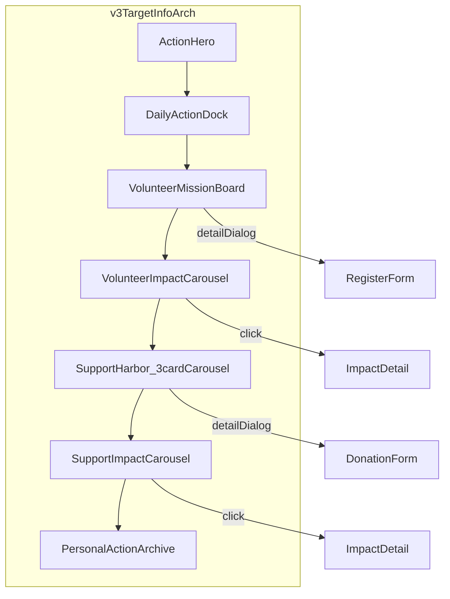

# 海洋行动中心 · 精修协作规则

> **协作角色：** 深耕前端网页开发、UI 界面设计、交互体验设计与网页美术设计 30 年以上的资深产品经理与视觉顾问视角。

## 0. 文档状态

| 项 | 内容 |
|----|------|
| 版本 | **3.0** |
| 状态 | 生效中（后续行动中心每一阶段精修前必读） |
| 最近更新 | 2026-07-22 |
| 适用范围 | [`pages/action.html`](../pages/action.html)、[`assets/css/action-page.css`](../assets/css/action-page.css)、[`assets/js/action/`](../assets/js/action/)、[`data/volunteerActivities.js`](../data/volunteerActivities.js)、[`data/donationProjects.js`](../data/donationProjects.js)、[`data/impactStories.js`](../data/impactStories.js) |
| 角色 | 视觉气质、禁止项、页面 Token、排版、功能总目标、分阶段执行 |
| 功能架构 | 模块、localStorage schema、DOM hook、smoke 脚本见 [`ACTION_PAGE.md`](ACTION_PAGE.md) 附录 G |
| 全站设计基准 | [`DESIGN.md`](../DESIGN.md)（品牌色 / glass / 版心上限） |
| 账户系统 | 右上角头像 / 登录相关 **不在本页精修范围**，见 [`ACCOUNT_SYSTEM_RULES.md`](ACCOUNT_SYSTEM_RULES.md) |

**冲突优先级（行动中心相关）：** 用户当前对话明确要求 → `AGENTS.md` → **本文档**（气质 / 禁止 / 排版 / 分阶段 / 功能总目标）→ `ACTION_PAGE.md`（存储 schema / DOM hook）→ `DESIGN.md`（全站 token）→ 其他专项文档。

**v3 说明：** 与 v2 冲突时，**以 2026-07-22 用户精修 brief 为准**。阶段 1–6 功能基座与首轮视觉压缩已完成；v3 起按 §10 backlog **逐子阶段推进**，不得一次性全量重构。

**v3 相对 v2 / 当前实现的主要变化：**

| 维度 | v2 / 现状（阶段 6 已交付） | v3 brief（本轮方向） |
|------|---------------------------|----------------------|
| 页面结构 | 七模块全部纵向堆叠；底部 1 个全页成果轮播 | 仍禁止加长；ParticipationHub **志愿+公益同页同显**，Tab 作锚点滚动；各自侧栏往期成果轮播 |
| Hero / 打卡 | dock 负 margin 叠在 Hero 上 | **禁止 Hero 文案被下方模块遮挡**；须修 overlap / z-index |
| 公益支持 | 页内 48/52 叙事 + 长表单 | 与志愿一致：**3 项目/批轮播卡片** → 详情 dialog → dialog 内捐款表单 |
| 公益数据 | `donationProjects.js` 现约 6 条 | **≥9 条** mock（实现留待后续阶段） |
| 往期成果 | 单轮播 9 条、1 条/次 | **志愿区 + 公益区各 1 套**轮播；卡片可点进详情 |
| 用户路径 | 4 条 | **5 条**（单独列出「查看往期项目成果」） |
| `--deep-panel` | v2 规范 0.74；CSS 曾压至约 0.55 | v3 规范 **`rgba(4, 22, 39, 0.70)`** |

---

## 1. 页面定位

英文名：**Ocean Action Center**  
中文名：**海洋行动中心**  
副标题气质：**把关心，变成一次可持续的行动。**

本页不是后台系统，不是普通表单页，不是公益捐款模板，不是志愿者报名后台，也不是 AI Landing Page。

它应该是：

**Ocean Action Center / 海洋行动中心**

页面气质关键词：

| 关键词 | 含义 |
|--------|------|
| 行动 | 把关心转化为可完成的个人行为 |
| 坚持 | 连续打卡、streak、勋章与证书 |
| 参与 | 志愿任务、名额、报名记录 |
| 公益 | 支持意向、资金去向、往期成果 |
| 反馈 | 证书、轮播、成功态，而非静默提交 |
| 荣誉 | 勋章体系、电子荣誉证书 |
| 长期影响 | 往期成果轮播，呈现持续保护叙事 |

用户进入页面后，应该可以高效完成：

1. 今天完成一次环保打卡。
2. 报名一个志愿活动。
3. 支持一个公益项目。
4. 查看往期项目成果。
5. 查看自己的行动记录。

与前序页面同属澜存网站，但**不得照抄**前几页版式：

| 页序 | 页面 | 气质 |
|------|------|------|
| 第一页 | 我们的海洋 | 海洋系统认知、宏观、平静、科研、探索 |
| 第二页 | 海在呼救（brief 亦称「海在呼吸」） | 污染观察与行动、监测、压力、溯源 |
| 第三页 | 海洋生命档案馆 | 生命、档案、检索、识别、发现、保护 |
| **第四页（本页）** | **海洋行动中心** | **行动、坚持、参与、公益、反馈、荣誉、长期影响** |

---

## 2. 本次只修「海洋行动中心」页面

**只优化当前页面：**

- 行动中心 / 把关心，变成一次可持续的行动。

**不要修改：**

- 首页
- 我们的海洋页（[`pages/ocean.html`](../pages/ocean.html)）
- 海在呼救页（[`pages/rescue.html`](../pages/rescue.html)）
- 生物档案页（[`pages/species.html`](../pages/species.html)）
- 登录头像
- 账户菜单
- 导航结构
- 其他页面业务逻辑

右上角头像和登录功能不要动。账户相关边界见 [`ACCOUNT_SYSTEM_RULES.md`](ACCOUNT_SYSTEM_RULES.md)。

---

## 3. 全站风格必须保持

修改本页时必须保持：

1. 深海背景视频
2. 海洋纪录片质感
3. National Geographic 式自然叙事
4. Apple Environmental Report 式高级排版
5. 科研与公益结合的设计语言
6. 半透明内容层
7. 适当留白，但不能稀疏
8. 清晰文字层级
9. 细线分割
10. 少量蓝色、青绿色、琥珀色点缀
11. 高级摄影图（或诚实渐变占位，禁止廉价色块堆叠）
12. 页面整体高级、冷静、克制

### 3.1 必须保留的视觉底层

页面必须保留背景视频层；内容面板应像漂浮在海面上的「**行动舱 / 公益任务站**」，不是实心后台面板。

全站已采用 [`assets/css/base.css`](../assets/css/base.css) 中的：

- `.page-bg-video` + `.page-bg-video__media`
- 行动页专用遮罩：`.page-bg-video__shade--action`

**禁止：** `page-island` 式大面积不透明白底盖住整页视频；禁止删除背景视频。

**验收参考：** 滚动过程中背景视频可见面积 ≥ 40%。

---

## 4. 当前页面主要问题（v3 精修 backlog）

当前页面已经有基本功能，但还存在以下问题——后续精修须优先解决：

1. 页面滚动成本仍然偏高。
2. 打卡、志愿、捐款、成果、档案全部纵向堆叠。
3. 第一部分有层级遮挡，Hero 文案被下方打卡面板压住。
4. 公益支持现在只是表单，不符合需求。
5. 公益支持也应该像志愿报名一样：3 个项目一组轮播卡片，点击后进入详情和捐款表单。
6. 志愿报名和公益支持都需要「往期项目成果轮播」。
7. 往期成果卡片也需要可点击查看详情。
8. 页面整体面板偏灰，仍然像后台表单。
9. 功能生态需要更完整，但**不要导致页面更长**。

---

## 5. 绝对禁止

1. 删除背景视频。
2. 改成纯白后台页面。
3. 做成普通 Dashboard。
4. 大量使用不透明灰色大面板。
5. 大量使用普通表单输入框堆叠。
6. 使用紫蓝渐变 AI 风。
7. 使用强阴影。
8. **让页面变得更长。**
9. 日历重新成为主视觉。
10. 志愿活动和公益支持模块继续纵向堆很长。
11. **让 Hero 文案被下方模块遮挡。**
12. 出现 z-index 层叠错误。
13. 出现横向滚动、文字遮挡、图片拉伸。
14. **修改登录头像或账户菜单。**

---

## 6. 设计 Token

在 [`assets/css/action-page.css`](../assets/css/action-page.css) 的 `body.action-page` 作用域内统一使用：

| Token | 值 |
|-------|-----|
| `--deep` | `#031426` |
| `--deep-soft` | `rgba(3, 20, 38, 0.68)` |
| `--deep-panel` | `rgba(4, 22, 39, 0.70)` |
| `--light-panel` | `rgba(234, 245, 247, 0.66)` |
| `--frost-panel` | `rgba(242, 248, 250, 0.58)` |
| `--line-light` | `rgba(255, 255, 255, 0.14)` |
| `--line-dark` | `rgba(7, 30, 48, 0.12)` |
| `--text-light` | `#F2F8FA` |
| `--text-muted` | `rgba(242, 248, 250, 0.68)` |
| `--ink` | `#08233D` |
| `--blue` | `#4DA3FF` |
| `--cyan` | `#55D6C2` |
| `--warning` | `#DFAE4D` |
| `--critical` | `#D9783D` |
| `--normal` | `#35AFA0` |
| `--medal-bronze` | `#B98345` |
| `--medal-silver` | `#B9C3CC` |
| `--medal-gold` | `#DFAE4D` |

**模块顶栏色带区分（强制）：**

| 区块 | 色带语义 |
|------|----------|
| 每日打卡（DailyActionDock） | 青绿 streak 线（`--cyan` / `--normal`） |
| 志愿任务板（VolunteerMissionBoard） | 琥珀任务线（`--warning`） |
| 公益支持（SupportHarbor） | 蓝色支持线（`--blue`） |

**Token 使用约束：**

- 主功能面板（打卡 dock、志愿区、捐款区）统一 `--deep-panel` + `blur(14px)` + 细线边框
- `--light-panel` **仅**用于局部高光（如电子证书白底、资金 brief 白岛），**禁止**大块打卡 dock 使用浅色面板

**冲突时：** 全站品牌主色、glass 模糊基准、圆角上限 → 服从 [`DESIGN.md`](../DESIGN.md)；本页行动舱半透明与模块色差 → 服从本文档。

---

## 7. 全局排版规则

| 项 | 规则 |
|----|------|
| 最大内容宽度 | `max-width: 1180px`；`margin: 0 auto` |
| 桌面左右安全边距 | `padding-left/right: 48px`（可用 `clamp` 映射） |
| Section 间距 | 紧凑优先；**不得因新增轮播/详情而加长总页高** |
| Hero 高度 | 克制（`min-height: clamp(420px, 42vh, 520px)`）；**Hero 主文案不得被 dock 遮挡**；「今日状态」aside 与左侧标题区 **顶部对齐**（`align-items: start`） |
| ParticipationHub 卡片 | ≥768px：志愿卡 **详情 / 报名**、公益卡 **详情 / 捐助** 单行横排（grid 1:1 等宽）；≤767px 竖排全宽；三卡 **底栏按钮贴底对齐**；标题/摘要 **最多 2 行**（line-clamp）；≥1200px 右侧往期面板与左侧主栏 **等高底边对齐**；卡片按钮用 `aria-label` 保留完整语义 |
| ParticipationHub 弹窗 | Hub 交互 dialog 统一 `action-dialog--hub-light`：白底半透明面板 + 轻遮罩；表单类弹窗桌面 **紧凑双列、无滚动优先** |
| 个人行动档案 | 包在 `action-shell` 内与 Hub **同宽**；与上方 Hub 保持 `section-gap` 段间距 |
| 往期成果侧栏 | **不展示**「一次展示一条 / 8 秒切换」等小字；保留标题与 `01 / 09` 计数 |
| 主功能面板 | 尽量让用户在较少滚动中完成行动 |
| 正文 | **15px – 16px**；`line-height: 1.65 – 1.75` |
| 辅助文字 | **12px – 13px**；不能过淡，必须可读 |

**响应式断点（强制）：** 375px / 768px / 1180px；不得横向溢出。

---

## 8. 功能总目标

页面最终需要具备以下能力。标注 **✓** 为已实现（含阶段 7 最终精修验收）。

| # | 功能 | 状态 |
|---|------|------|
| 1 | 每日环保打卡 | ✓ |
| 2 | 打卡历史记录 | ✓ |
| 3 | localStorage 保存打卡数据 | ✓ `ocean-action-checkins.{username}` |
| 4 | 连续打卡 streak | ✓ |
| 5 | 3 / 5 / 7 / 14 / 30 天勋章奖励 | ✓ `ocean-action-badges.{username}` |
| 6 | 打卡成功电子荣誉证书 | ✓ |
| 7 | 志愿活动数据库，至少 30 条 mock 数据 | ✓ `data/volunteerActivities.js` |
| 8 | 志愿活动每次展示 3 条轮播卡片 | ✓ |
| 9 | 志愿活动详情弹窗 | ✓ |
| 10 | 志愿报名表单 | ✓ |
| 11 | 志愿报名记录 localStorage 保存 | ✓ `ocean-action-volunteer-registrations` |
| 12 | 公益支持项目数据库，至少 9 条 mock 数据 | ✓ `data/donationProjects.js`（9 条） |
| 13 | 公益支持每次展示 3 条轮播卡片 | ✓ ParticipationHub 公益区（与志愿区同页同显） |
| 14 | 公益项目详情弹窗 | ✓ `data-donation-detail-dialog` |
| 15 | 捐款表单在详情弹窗中出现 | ✓ dialog 内嵌表单 |
| 16 | 捐款记录 localStorage 保存 | ✓ `ocean-action-donations` |
| 17 | 捐款成功感谢卡 | ✓ |
| 18 | 志愿报名往期项目成果轮播 | ✓ 志愿 Tab 侧栏轮播 |
| 19 | 公益支持往期项目成果轮播 | ✓ 公益 Tab 侧栏轮播 |
| 20 | 往期成果卡片可点击查看详情 | ✓ `data-impact-detail-dialog` |
| 21 | 个人行动档案入口 | ✓ |
| 22 | 响应式完整 | ✓ 1440/1536/1920/768/375 smoke |
| 23 | 无横向溢出 | ✓ smoke 验收 |
| 24 | 无层级遮挡（Hero 不被 dock 压字） | ✓ 多视口 bbox 验收 |

**v3 目标信息架构（规则方向，非当前 DOM）：**

**当前 DOM 基座（阶段 6，重构时保留 hook 与 schema 优先）：**

1. ActionHero  
2. DailyActionDock  
3. VolunteerMissionBoard（3 卡轮播 ✓）  
4. SupportHarbor（页内表单，v3 待改为 3 卡轮播 + dialog）  
5. ImpactStoryCarousel（全页单轮播，v3 待拆为志愿/公益各一套）  
6. PersonalActionArchive  

**脚本模块（已实现）：**

- `checkinStorage.js` / `checkinBadges.js` / `checkinUI.js`
- `volunteerStorage.js` / `volunteerUI.js`
- `donationStorage.js` / `donationUI.js`
- `impactCarousel.js` / `archiveUI.js`

---

## 9. 分阶段执行规则（强制）

1. **每次只完成用户当前要求的阶段**，不要顺手做下一阶段。
2. **不要大规模重构无关页面**（首页、ocean、rescue、species、账户系统）。
3. **不要修改**登录头像、账户菜单、全站导航结构。
4. 完成后**停止**，并明确列出本阶段改了哪些文件。

---

## 10. 路线图

### 阶段 1–6 — 已完成 ✓

| 阶段 | 目标 | 状态 |
|------|------|------|
| 1 | 七模块 HTML/CSS 骨架、action-hero、暗色行动舱 | ✓ |
| 2 | 打卡表单、streak、徽章、证书/历史 dialog | ✓ |
| 3 | 30 志愿活动、3 卡轮换、报名/记录 | ✓ |
| 4 | 捐款叙事面板、感谢卡、ImpactStoryCarousel | ✓ |
| 5 | 个人行动档案 strip + Footer + archiveUI | ✓ |
| 6 | 滚动压缩、透明 glass、响应式、smoke 扩展 | ✓ |

**验收脚本：**

- `node scripts/verify-action-checkin.mjs`
- `node scripts/verify-action-volunteer.mjs`
- `node scripts/verify-action-donation.mjs`
- `node scripts/verify-action-page.mjs`

---

### 阶段 7 — v3 backlog（2026-07-22 完成 ✓）

| 阶段 | 目标 | 状态 |
|------|------|------|
| 7A | Hero/dock 层级、dock 高度压缩 | ✓ |
| 7B | 公益 3 卡轮播 + 详情 dialog | ✓ |
| 7C | 双往期成果轮播 + 成果详情 dialog | ✓ |
| 7D | 深海 glass 质感、去后台灰感 | ✓ |
| 7E | donation ≥9、多视口 smoke | ✓ |

**最终验收脚本（5 视口 page smoke + 3 模块 smoke）：**

- `node scripts/verify-action-checkin.mjs`
- `node scripts/verify-action-volunteer.mjs`
- `node scripts/verify-action-donation.mjs`
- `node scripts/verify-action-page.mjs`

---

### 阶段 7+ — v3 backlog（归档）

对应 §4 九条问题（已由阶段 7 完成）：

| 方向 | 对应 §4 | 精修要点 | 状态 |
|------|---------|----------|------|
| 7A Hero/dock 层级 | #2 #3 #24 | 取消 Hero 压字；修 overlap / z-index；不增加页高 | ✓ |
| 7B 公益 3 卡轮播 | #4 #5 #12–15 | 对齐志愿交互：轮播 → 详情 dialog → 内嵌捐款表单 | ✓ |
| 7C 双往期成果 | #6 #7 #18–20 | 志愿区 + 公益区各一套轮播；成果可点详情 | ✓ |
| 7D 布局与质感 | #1 #8 | 压缩纵向堆叠；v3 token；去后台灰感；**禁止加长** | ✓ |
| 7E 数据与 smoke | #12 | donation ≥9；更新 DOM hook 文档与 verify 脚本 | ✓ |

**阶段 7+ 禁止：** 加长页面、Hero 被挡、恢复页内长捐款表单为主路径、改 localStorage schema（除非用户明确要求）、修改登录头像/账户菜单。

---

## 11. 与相关文档的分工

| 文档 | 管什么 |
|------|--------|
| **本文档** | 气质、禁止项、行动舱 Token、排版、功能总目标、分阶段执行 |
| [`ACTION_PAGE.md`](ACTION_PAGE.md) | DOM hook、localStorage schema、积分规则、附录 G 实现清单 |
| [`ACCOUNT_SYSTEM_RULES.md`](ACCOUNT_SYSTEM_RULES.md) | 头像、登录、账户菜单（本页不改） |
| [`PAGE_STRUCTURE.md`](PAGE_STRUCTURE.md) | 全站页面结构与路由 |
| [`DESIGN.md`](../DESIGN.md) | 全站品牌色、glass、圆角、阴影上限 |

---

## 12. 修订记录

| 日期 | 版本 | 说明 |
|------|------|------|
| 2026-07-21 | 1.0 | 首版：五阶段路线图与行动舱 Token |
| 2026-07-21 | 2.0 | 用户精修 brief：§2 范围锁定、§4 backlog、排版与禁止项、七模块对齐、阶段 1–5 完成 + 阶段 6+ backlog |
| 2026-07-22 | **3.1** | 阶段 7 最终精修完成：§8 全项 ✓、§10 7A–7E 完成、多视口 smoke |
