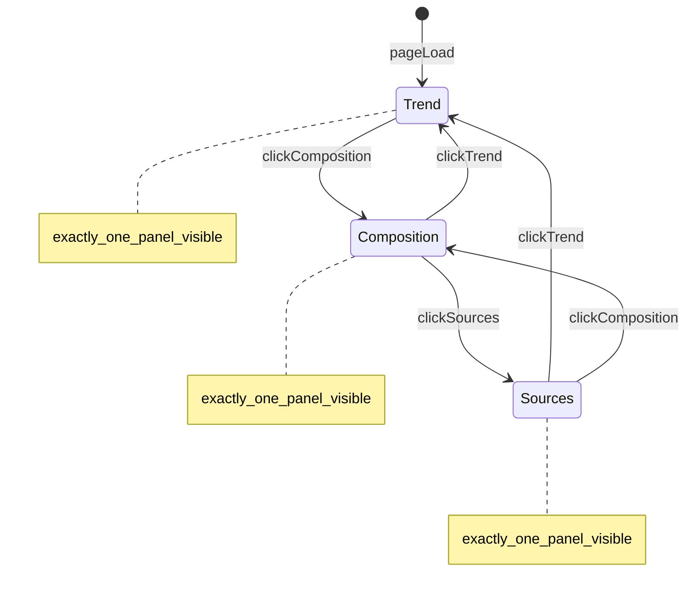

# 「海在呼救」· Command Deck 图表 Tab 区协作规则

## 0. 文档状态

| 项 | 内容 |
|----|------|
| 版本 | 1.0 |
| 状态 | 生效中（修改 rescue 页 **`.command-bottom` 图表 Tab 子树** 前必读） |
| 最近更新 | 2026-07-22 |
| 适用范围 | [`pages/rescue.html`](../pages/rescue.html) 内 `#pollution-command .command-bottom`；[`assets/css/rescue-page.css`](../assets/css/rescue-page.css) 中 `.command-bottom` / `.command-chart-*` / `.chart-frame` / `.rescue-trend` / `.rescue-pie` / `.rescue-bar`；[`assets/js/rescue/command-deck.js`](../assets/js/rescue/command-deck.js) Tab 逻辑；[`assets/js/rescue/pollution-overview.js`](../assets/js/rescue/pollution-overview.js) 图表渲染 |
| 角色 | Tab 行为宪法、高度预算、三图一致性、禁止项、分阶段执行、验收标准 |
| 功能与数据契约 | [`RESCUE_PAGE.md`](RESCUE_PAGE.md) §3.1 |
| 地图监测局部 | [`RESCUE_LIVE_CONSOLE_RULES.md`](RESCUE_LIVE_CONSOLE_RULES.md)（不重复写地图规则） |
| 全页气质 | [`RESCUE_OBSERVATORY_RULES.md`](RESCUE_OBSERVATORY_RULES.md) |
| 全站设计基准 | [`DESIGN.md`](../DESIGN.md) |

**冲突优先级（图表 Tab 子树）：** 用户当前对话明确要求 → `AGENTS.md` → **本文档**（Tab 行为 / 高度 / 三图一致性）→ [`RESCUE_LIVE_CONSOLE_RULES.md`](RESCUE_LIVE_CONSOLE_RULES.md) → [`RESCUE_PAGE.md`](RESCUE_PAGE.md) → `DESIGN.md`。

---

## 1. 页面与子树定位

| 项 | 内容 |
|----|------|
| 英文名 | Ocean Pollution Observatory |
| 中文名 | 海洋污染观察与行动页（Nav 仍可为「海在呼救」） |
| Hero 眉标 | `02 / 海在呼吸` |
| **本次唯一精修子树** | `#pollution-command .command-bottom`（Tab 头 + 三个 tabpanel） |

### 1.1 不在本次范围（绝对不改）

- Hero（`.pollution-hero` / status ribbon）
- 地图监测区（`#live-monitoring`、`.monitor-window`、pin / 站点卡 / 指标条）
- 左侧污染压力总览（`.pressure-summary-panel`、`data-rescue-risk-matrix`）
- 污染源解决方案（`#source-solution` / Source Solution Workspace）
- Footer（`#rescue-footer` / Action Brief）
- 全站导航与登录头像 / 账户弹窗
- 其他页面（ocean / species / action / home 等）

---

## 2. 当前问题与根因

### 2.1 用户可见症状

- 趋势图、构成图、数据来源 **三块同时展示**，页面纵向堆叠巨大，滚动成本暴增
- Tab 按钮存在但 **未真正切换**，仅高亮样式变化
- 折线、饼图、条形图 **尺寸不统一**，视觉失衡

### 2.2 技术根因（已确认）

[`command-deck.js`](../assets/js/rescue/command-deck.js) 的 Tab 逻辑本身正确：`panel.hidden = !show`。

HTML 初始状态也正确：构成 / 来源 panel 带 `hidden` 属性。

**失效原因：** CSS 作者规则覆盖 HTML `[hidden]`。典型情况：

- `.command-chart-panel { display: flex }` 或
- `.command-chart-panel--composition { display: grid }`

在部分浏览器中，作者 `display` 规则优先级高于 UA 对 `[hidden]` 的默认 `display: none`，导致 **多个 tabpanel 同时进入文档流**。

参考：[`assets/css/profile-dashboard.css`](../assets/css/profile-dashboard.css) 注释——「Author display rules override the UA `[hidden]` stylesheet without this.」

### 2.3 已知债务（Phase 1 必修）

[`rescue-page.css`](../assets/css/rescue-page.css) 约 L710–721：回滚遗留 **CSS 语法损坏**（`.command-sources-list {` 选择器丢失，属性块 orphaned）。实施 Phase 1 时必须一并修复，否则来源 Tab 样式不可预期。

---

## 3. Tab 行为宪法

### 3.1 三个 Tab 与 panel 映射

| Tab 文案 | Tab hook | Panel hook | 默认 |
|----------|----------|------------|------|
| 趋势图 | `data-chart-tab="trend"` | `data-rescue-chart-panel="trend"` | **唯一默认可见** |
| 构成图 | `data-chart-tab="composition"` | `data-rescue-chart-panel="composition"` | `hidden` |
| 数据来源 | `data-chart-tab="sources"` | `data-rescue-chart-panel="sources"` | `hidden` |

### 3.2 强制行为

1. **任意时刻只允许 1 个** `[data-rescue-chart-panel]` 在 DOM 中可见（参与布局、占用高度）
2. 点击 Tab → 仅对应 panel 显示；其余 panel **必须** 设置 `hidden` 属性
3. 页面初始加载：**必须** 激活「趋势图」（`activate('trend')` 或等价逻辑）
4. `pageState.selectedChartTab` 与当前可见 panel 保持一致

### 3.3 绝对禁止的「假隐藏」

以下方式 **不得** 用于 tabpanel 切换：

- 三 panel 同时无 `hidden`、靠 CSS 堆叠在文档流中
- 仅用 `opacity: 0` / `visibility: hidden` / `height: 0` 而不移除布局占位
- 负 `z-index` 叠放但仍占高度
- 去掉 Tab、改为三屏纵向堆叠 IA

### 3.4 无障碍

- 保留 `role="tablist"`、`role="tab"`、`role="tabpanel"`
- 激活 Tab 设置 `aria-selected="true"`，其余为 `false`
- Tab 按钮必须键盘可聚焦、可 Enter/Space 触发（现有点击绑定可保留，不得破坏焦点环）

### 3.5 状态机（示意）



---

## 4. 高度与滚动预算

| 规则 | 说明 |
|------|------|
| `.chart-panel-body` | **min-height: 300px；max-height: 360px**；`overflow: hidden` |
| `.chart-tab-content` | 三 Tab **统一固定 320px**（`height` / `min-height` / `max-height` 均为 320px） |
| `.chart-canvas-wrap` | 折线 / 饼 / 柱 **统一 280px** 画布高度 |
| Tab 切换 | **不得** 改变 `.pollution-chart-panel` / `.command-bottom` 总高度；三 Tab 共用同一舞台 |
| 整页 scrollHeight | 禁止三 panel 同时渲染倍增；来源 Tab 使用 `.sources-grid` 2 列 + `.sources-tab { overflow: auto }`，不得无上限撑页 |
| 图表区上限 | 可视图表区（body + tab + canvas）**不得** 超过 **420px** 级失控堆叠；禁止回到三屏纵向同时展示 |
| overflow | panel 可裁切内部溢出；折线 X 轴 / 年份须通过 SVG viewBox 适配，而非盲目加高 shell |

---

## 5. 三 Tab 内容与布局（Phase 2.5）

三 Tab 共用 `.chart-tab-content` **320px** 固定高度；切换时 panel 外框不跳变。

### 5.1 趋势图 Tab（`.trend-tab`）

| 项 | 规范 |
|----|------|
| 布局 | `grid-template-columns: 0.32fr 0.68fr`；左 `.trend-tab__copy` 说明，右 `.trend-tab__chart` 折线 |
| 折线 canvas | `.chart-canvas-wrap` **280px** |
| 线条 | `var(--chart-blue)`；`stroke-width: 2` |
| 点 | 默认 `r="4"`；hover/focus **r="5"** |
| Tooltip | `.chart-tooltip` 深色半透明（`--chart-tooltip-bg`） |
| 坐标轴 | `var(--chart-axis)` → `rgba(242,248,250,0.18)`；仅 x 轴基线 |
| 年份标签 | `var(--chart-text)` → `rgba(242,248,250,0.62)` |

### 5.2 构成图 Tab（`.composition-tab`）

| 项 | 规范 |
|----|------|
| 布局 | `grid-template-columns: 0.36fr 0.64fr`；**禁止** 双 280px 大图并排 |
| 左侧 | `.composition-tab__ring`：140px 环 + legend（塑料 85% / 其它 15%） |
| 右侧 | `.composition-tab__bars`：三行统一高度比例条（60% / 10% / 30%） |
| 配色 | 环：蓝 + 青（`--chart-blue` / `--chart-cyan`）；条：track `--chart-track`、fill `--chart-blue` |

### 5.3 数据来源 Tab（`.sources-tab`）

| 项 | 规范 |
|----|------|
| 布局 | `.sources-grid { grid-template-columns: repeat(2, 1fr) }` |
| 高度 | `.sources-tab { height: 320px; overflow: auto }` |
| 分割 | `.sources-grid__item` 边框 `var(--chart-axis)`；**禁止** 单列长列表撑页 |
| 内容 | 5 条机构 + `docs/DATA_SOURCES.md` 共 6 格 |

### 5.4 配色宪法（Phase 2.6）

`.pollution-chart-panel` 作用域 token：

| Token | 值 | 用途 |
|-------|-----|------|
| `--chart-blue` | `#4DA3FF` | 折线、点、比例条 fill |
| `--chart-cyan` | `#55D6C2` | 饼图「其它」段、legend 次色 |
| `--chart-amber` | `#DFAE4D` | 预警/强调（Chart Panel 内克制使用） |
| `--chart-text` | `rgba(242,248,250,0.62)` | 标签、legend、来源说明 |
| `--chart-axis` | `rgba(242,248,250,0.18)` | 坐标轴、网格分割线 |
| `--chart-track` | `rgba(242,248,250,0.12)` | 比例条轨道 |
| `--chart-tooltip-bg` | `rgba(4,18,32,0.88)` | 趋势 tooltip 背景 |

**禁止：** 默认图表色、红绿蓝黄高饱和堆叠、白底图表、黑色坐标轴、粗折线（>2px）、>150px 饼图、JS 硬编码 hex。

### 5.5 禁止项（布局 + 配色）

- neon 发光、三 Tab 各自独立高度体系
- JS 硬编码 `#4da3ff`（须走 CSS token）
- 构成 Tab 同时展示两个 280px 级 chart canvas

---

## 6. DOM / JS 契约（不得破坏）

| 功能 | Hook / 入口 |
|------|----------------|
| Tab 按钮 | `[data-chart-tab="trend\|composition\|sources"]` |
| Tab 单槽 body | `[data-rescue-chart-body]`（任意时刻仅 1 个子节点） |
| 趋势 Tab 宿主 | `[data-rescue-trend-tab]` |
| 构成 Tab 宿主 | `[data-rescue-composition-tab]` |
| 来源 Tab 宿主 | `[data-rescue-sources-tab]` |
| 完整来源弹窗 | `[data-rescue-data-sources-open]` → `<dialog data-rescue-data-sources-dialog>` |
| 渲染入口 | `renderTrendTab` / `renderCompositionTab` / `renderSourcesTab` |
| 初始化链 | `LANCUN_RESCUE.initCommandDeck` → `renderCommandDeckCharts` + `initChartTabs` |
| 页面状态 | `LANCUN_RESCUE.pageState.selectedChartTab` |

**遗留 export（兼容）：** `renderLineChart` → `renderTrendTab`；`renderPieChart` / `renderBarChart` 仍可单独渲染局部块。

**禁止：** 恢复 `data-rescue-pie-chart` + `data-rescue-bar-chart` 双宿主；禁止 `data-rescue-composition-carousel` 等未经确认的轮播 IA。

---

## 7. CSS 强制项

### 7.1 Tab 隐藏（Phase 1 必须）

```css
.command-chart-panel[hidden] {
  display: none !important;
}
```

若构成 panel 内 figure 等子节点也使用 `hidden`，同步添加对应 `[hidden] { display: none !important; }` 规则。

### 7.2 其他约束

1. 可见 tabpanel 上 **不得** 使用 `min-height: 430px` 等错误大屏预算
2. `.command-chart-panel--composition` 的 `display: grid` **允许**，但必须在 `[hidden]` 时仍被 §7.1 覆盖
3. 修复 `.command-sources-list` 语法损坏块（见 §2.3）
4. 样式改动 **不得** 修改 §6 所列 selector 名称

---

## 8. 绝对禁止

1. 修改 §1.1 所列区域（Hero / 地图 / 左栏 / Source / Footer / 导航 / 账户）
2. 三 panel 同时展示在页面上
3. 引入 Chart.js / ECharts 等第三方图表库（除非用户另行批准）
4. 重构 HTML IA 或删除现有 hook
5. 未经用户确认的整体「最终美化」或跨 Phase 顺手改动
6. 为「图表完整」而显著拉长整页 scrollHeight（超出 §4 单 panel 预算）

---

## 9. 分阶段执行

| 阶段 | 内容 | 主要文件 | 停止条件 |
|------|------|----------|----------|
| **Phase 1 · Tab 修复** | `[hidden]` CSS 强制；验证任意时刻仅 1 panel 可见；修复 `.command-sources-list` CSS 语法损坏 | [`rescue-page.css`](../assets/css/rescue-page.css)、必要时 [`command-deck.js`](../assets/js/rescue/command-deck.js) | 三 Tab 切换正常；列出改动文件并 **停止** |
| **Phase 2.6 · 配色统一** | `--chart-*` token；趋势 tooltip/active 点；构成蓝+青 legend | [`rescue-page.css`](../assets/css/rescue-page.css)、[`pollution-overview.js`](../assets/js/rescue/pollution-overview.js) | 三 Tab 视觉统一；**停止** |
| **Phase 3 · 验证** | 更新 [`verify-rescue-compact.mjs`](../scripts/verify-rescue-compact.mjs) 断言；有服务时跑 [`verify-rescue-observatory.mjs`](../scripts/verify-rescue-observatory.mjs) | verify 脚本 | 脚本通过；**停止** |

**协作约束：**

- 每次只完成 **一个** Phase
- 完成 Phase 后列出改动文件，**不顺手** 做下一阶段
- Phase 1 **不得** 改动 Hero / 地图 / Source / Footer

---

## 10. 验收标准

### 10.1 目视（桌面 1440×900）

1. 默认 **仅** 趋势图 panel 可见
2. 点击「构成图」→ 仅构成 panel 可见，趋势与来源 **完全消失**
3. 点击「数据来源」→ 仅来源列表 panel 可见
4. `.command-bottom` 高度紧凑，无「三屏纵向堆叠」感
5. 切换三 Tab 前后，底栏总高度 **基本一致**
6. Hero / 地图 / 左栏 / Source / Footer **无视觉变化**

### 10.2 脚本（Phase 3）

**静态断言（`verify-rescue-compact.mjs`）：**

- HTML 仍含三个 `data-chart-tab`（trend / composition / sources）
- CSS 含 `.command-chart-panel[hidden]` + `display: none !important`
- **不得** 含曾失败的 `data-rescue-composition-carousel` 轮播 hook（若未用户确认引入）

**运行时断言（`verify-rescue-observatory.mjs`，需本地服务）：**

- 每次点击 Tab 后：`document.querySelector('[data-rescue-chart-body]').children.length === 1`
- 构成 Tab 可见时 body 内仅含 `.composition-tab`；来源 Tab 仅含 `.sources-tab`

### 10.3 快速自检（开发时）

在 DevTools Console 执行：

```js
document.querySelector('[data-rescue-chart-body]').children.length
// 必须始终 === 1
```

---

## 11. 关联文档

| 文档 | 关系 |
|------|------|
| [`RESCUE_PAGE.md`](RESCUE_PAGE.md) §3.1 | 功能契约：三 Tab、单槽 mount；高度见本文档 §4（body 300–360 / tab 320 / canvas 280） |
| [`RESCUE_LIVE_CONSOLE_RULES.md`](RESCUE_LIVE_CONSOLE_RULES.md) | 地图监测局部；§4.4 图表简述应 **引用本文档**，避免双份冲突 |
| [`RESCUE_OBSERVATORY_RULES.md`](RESCUE_OBSERVATORY_RULES.md) | 全页气质与紧凑排版 |
| [`DESIGN.md`](../DESIGN.md) | 颜色 / glass / token |
| [`AGENTS.md`](../AGENTS.md) | 项目级协作；Phase 1 实施时建议将本文档加入文档优先级索引 |

---

## 12. 变更记录

| 日期 | 版本 | 说明 |
|------|------|------|
| 2026-07-22 | 1.3 | Phase 2.6：`--chart-*` 配色宪法、趋势 tooltip、构成蓝+青 legend |
