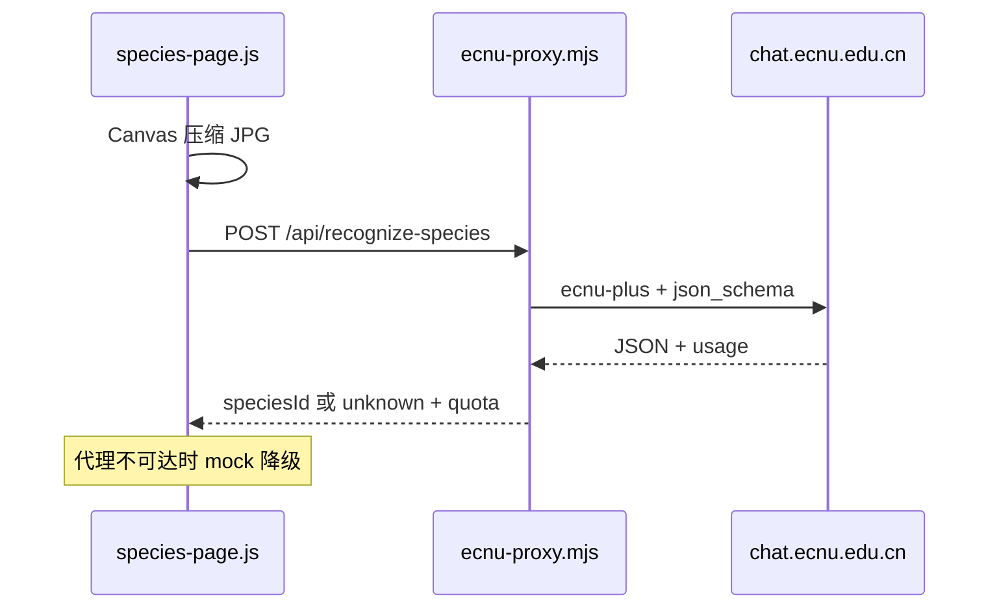

# 生物档案页 · AI 物种识别（本地实现说明）

> 版本：1.0 · 2026-07-20  
> 适用页面：[`pages/species.html`](../pages/species.html) 第三节「海洋动物 AI 识别器」

## 1. 作业定位：前端为主，识图带最小代理

本项目是 **Web 编程期末大作业**，核心技术栈为原生 **HTML5 / CSS3 / JavaScript ES6+**。站点主体（页面结构、样式、交互、数据展示）均为前端实现。

「AI 识图」是生物档案页的**加分互动**：用户上传图片 → 识别海洋生物 → 跳转档案详情。由于以下限制，无法把 API 完全放在浏览器里完成：

| 限制 | 说明 |
|------|------|
| API Key 安全 | 华东师范大学 ECNU 令牌不能写入前端 JS 或提交到 Git，否则会被泄露、额度被刷 |
| 浏览器 CORS | 静态页无法直接 `fetch` `chat.ecnu.edu.cn` |
| 课程要求 | 仍需体现对 HTML/CSS/JS 的掌握，**未引入 React/Vue 等框架** |

因此增加一个约 400 行的 **Node 本地代理** [`server/ecnu-proxy.mjs`](../server/ecnu-proxy.mjs)：只负责转发请求、解析 JSON、匹配物种档案。**页面渲染与用户操作仍 100% 在前端。**

代理未启动时，前端会自动 **fallback 到 mock 演示**，并在 UI 标注「演示模式 · 本地 mock」，保证纯静态打开页面也不白屏。

---

## 2. 架构概览



**数据流简述：**

1. 用户在 [`species-page.js`](../assets/js/species-page.js) 选择/拖放图片
2. 前端用 Canvas 将图片压缩至最长边 ≤1024px，转为 base64
3. `POST http://127.0.0.1:8787/api/recognize-species` 发给本地代理
4. 代理携带 `.env` 中的 Key，调用 ECNU [`ecnu-plus`](https://developer.ecnu.edu.cn/vitepress/llm/model.html) 多模态接口（结构化 JSON 输出）
5. 代理将模型返回的名称与 [`server/species-catalog.json`](../server/species-catalog.json) 中 12 种档案做匹配
6. 前端展示识别结果、置信度、额度进度条；匹配成功可「查看完整档案」

---

## 3. 关键文件

| 路径 | 职责 |
|------|------|
| [`pages/species.html`](../pages/species.html) | 识别器 UI、额度进度条、成功/未收录/失败态 |
| [`assets/js/species-page.js`](../assets/js/species-page.js) | 图片压缩、`recognizeSpecies()`、mock 降级、额度刷新 |
| [`assets/css/species-page.css`](../assets/css/species-page.css) | 识别区与额度条样式 |
| [`server/ecnu-proxy.mjs`](../server/ecnu-proxy.mjs) | HTTP 代理、ECNU 调用、物种匹配、额度持久化 |
| [`server/species-catalog.json`](../server/species-catalog.json) | 12 种物种 id / 名称 / 别名（与 `mock-data.js` 同步） |
| [`.env.example`](../.env.example) | 环境变量模板（真实 Key 放 `.env`，不入库） |
| [`package.json`](../package.json) | `npm run api` / `npm run serve` 脚本 |
| [`scripts/verify-species-ai.mjs`](../scripts/verify-species-ai.mjs) | 代理连通性与识别 smoke test |
| [`docs/DATA_SOURCES.md`](DATA_SOURCES.md) | 服务出处、模型与演示步骤 |
| [`docs/SPECIES_PAGE.md`](SPECIES_PAGE.md) | 页面宪法；附录 G.2 识别接口约定 |

---

## 4. 本地运行（复制即用）

**前置：** Node.js 18+（支持原生 `fetch`）

1. 复制环境变量模板并填入 ECNU 令牌：
   ```bash
   cp .env.example .env
   # 编辑 .env，填入 ECNU_API_KEY（从 ChatECNU「我的令牌」获取）
   ```
2. 终端 A — 启动识别代理：
   ```bash
   npm run api
   ```
   看到 `[ecnu-proxy] http://127.0.0.1:8787` 即成功。
3. 终端 B — 启动静态站点：
   ```bash
   npm run serve
   ```
4. 浏览器打开：`http://localhost:5500/pages/species.html`  
   滚动至第三节，上传 JPG/PNG（可用 `assets/media/species/` 下测试图）。

**可选验证：**

```bash
node scripts/verify-species-ai.mjs
```

---

## 5. 行为说明

| 项目 | 说明 |
|------|------|
| 识别模型 | ECNU `ecnu-plus`（支持图片理解，见[多模态对话](https://developer.ecnu.edu.cn/vitepress/llm/api/vision.html)） |
| 识别范围 | 优先匹配 `speciesArchive` 12 种；档案外显示「未在澜存档案库中找到」 |
| 结构化输出 | 代理请求 `json_schema`，解析失败时降级 `json_object` |
| 额度显示 | 本地 `.quota-usage.json` 累计 credits / 次数 + 页面进度条（**非**平台实时余额） |
| 失败降级 | 代理未启动或 API 报错 → 前端 `recognizeSpeciesMock()`，UI 标注演示模式 |
| 密钥安全 | `.env`、`APIkey.md`、`.quota-usage.json` 已在 `.gitignore` 中 |

---

## 6. 与纯静态部署的关系

若仅将 HTML/CSS/JS 部署到 **GitHub Pages** 等纯静态托管，**无法运行** `ecnu-proxy.mjs`，访客上传图片时会走 mock 演示。

真实 AI 识别需要以下之一：

- **答辩 / 验收时**在本机同时运行 `npm run api` 与 `npm run serve` 演示；或
- 将代理部署到可运行 Node 的服务器，并把前端 `RECOGNIZER_API` 改为该服务地址（部署细节不在本文展开）。

---

## 7. 相关链接

- [ECNU 模型介绍](https://developer.ecnu.edu.cn/vitepress/llm/model.html)
- [ECNU 多模态对话 API](https://developer.ecnu.edu.cn/vitepress/llm/api/vision.html)
- [ECNU 我的令牌](https://developer.ecnu.edu.cn/vitepress/llm/token.html)
- 项目内：[`DATA_SOURCES.md` — AI 物种识别](DATA_SOURCES.md) · [`SPECIES_PAGE.md` — 附录 G.2](SPECIES_PAGE.md)
